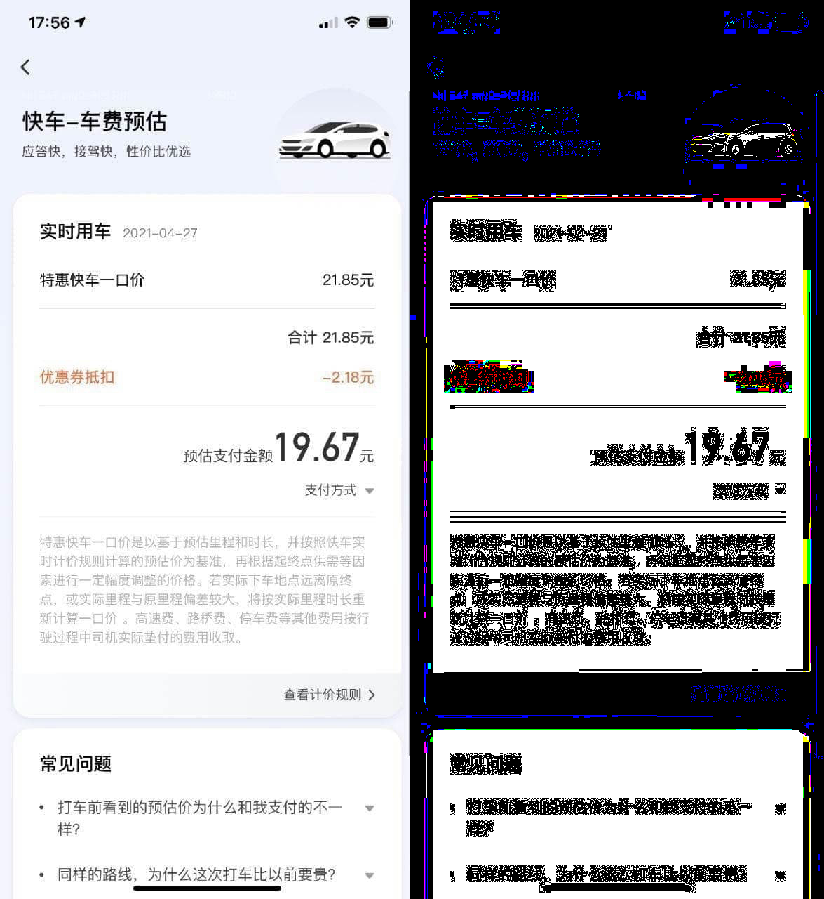

# color-card

从图片中
[提取色卡](#crowd) /
[提取线稿](#line) /
[勾线](#line) /
[调色](#line) /
[筛查低级水印](#水印筛查)(如豆瓣).

### About

`Python` 太慢了, 改用 `C++`!

先用 `ffmpeg` 将图片转为位图再处理.
要不然还得用 `opencv`, 没必要.

将图片先缩小再处理就很不必要了, 因为 `C++` 跑得~~比香港记者还~~快.


### Environmental Dependence

#### Compile

Usually, as long as you can compile the CPP.

#### Run

`ffmpeg` (Include `ffmpeg` `ffprobe` `ffplay`).

##### Windows

[FFmpeg](https://github.com/BtbN/FFmpeg-Builds/releases/tag/latest)

##### Ubuntu / Debian

```sh
sudo apt update
sudo apt install ffmpeg
```

##### CentOS / RedHat

```sh
sudo yum update
sudo yum install ffmpeg
```

##### Arch Linux

```sh
sudo pacman -Syu ffmpeg
```


### Clone

```sh
git clone --recurse-submodules --remote-submodule git@github.com:userElaina/color-card.git
```


### Function

#### Start

引用头文件 (如 `#include "bmp.hpp"`) 后, 可手动调整变量 `OUTPUT` 为以下常量的或:

`OUTPUT_DEBUG` 是否控制台输出debug信息;

`OUTPUT_PROGRESS` 是否控制台输出当前执行进度(如 `Loading...` );

`OUTPUT_LIST` 是否控制台输出色卡信息(格式 `("%06X %d",color,pixels)` 或 `("%06X",color)` );

`OUTPUT_HTML` 是否保存如下图样子的 `html`;

`OUTPUT_PIC` 是否保存 `line` 函数处理后的图片.


#### `crowd`

将像素分类,按照比例提取色卡.

```cpp
void crowd(std::string pth,double limit=0.01,int need=256);
```

`pth` 文件路径;

`limit` 色系占比小于 *limit* 的颜色将被忽略;

`need` 获得一个 *need* 种颜色的色卡.

html 中的 `Level n` 意味着将颜色分为 `1<<(n*3)` 类计数.

#### `naive`

将图片划分成多个矩形区域,分别根据每个区域的像素分布提取一种颜色,从而提取色卡.

```cpp
void naive(std::string pth,int needx=4,int needy=4);
```

`pth` 文件路径;

`needx needy` 获得一个 *needx\*needy* 种颜色的色卡.

html 中的 `Level` 无意义.

#### `line`

将图片勾线/提取线稿+调色.

```cpp
void line(std::string pth,int dis=96,int onlyline=0,int color=-1)
```

`pth` 文件路径;

`dis` 数字越大,勾线越少.当 `dis>=765` 时,一定不会有任何勾线;

`onlyline` 是否只保留线稿;

`color` 负值表示不调色,正值表示调色使用的标准颜色.


原图(左上), 勾线(右上), 线稿(左下), 勾线+调色(右下)

##### 水印筛查

线稿提取原理为对比相邻像素点颜色距离, 因此该函数也可用于水印(低级)筛查.


请设置 `dis` 为较小值(如 `10`), `onlyline=1` 后使用.

e.g.
```cpp
line("./example/douban.jpg",9,1);
```


警告: 在很多地方已应用[更难以筛查的技术](https://www.zhihu.com/question/50735753)来隐藏水印.

#### `linear`

```cpp
inline void linear(std::string pth,int rgb_black0,int rgb_white0,int rgb_black1,int rgb_white1,int con=0b111)
```

`pth` 文件路径;

将图片从 [`rgb_black0`,`rgb_white0`] 线性变换为 [`rgb_black1`,`rgb_white1`];

`con` 控制是否对 R (`con&4`), G (`con&2`), B (`con&1`) 三个分量进行变换.



通过更个性化的参数增强水印筛查效果.

### 由来


### To Do

将图片划分为不规则的颜色相近的区域,并生成色卡.

命令行工具.
